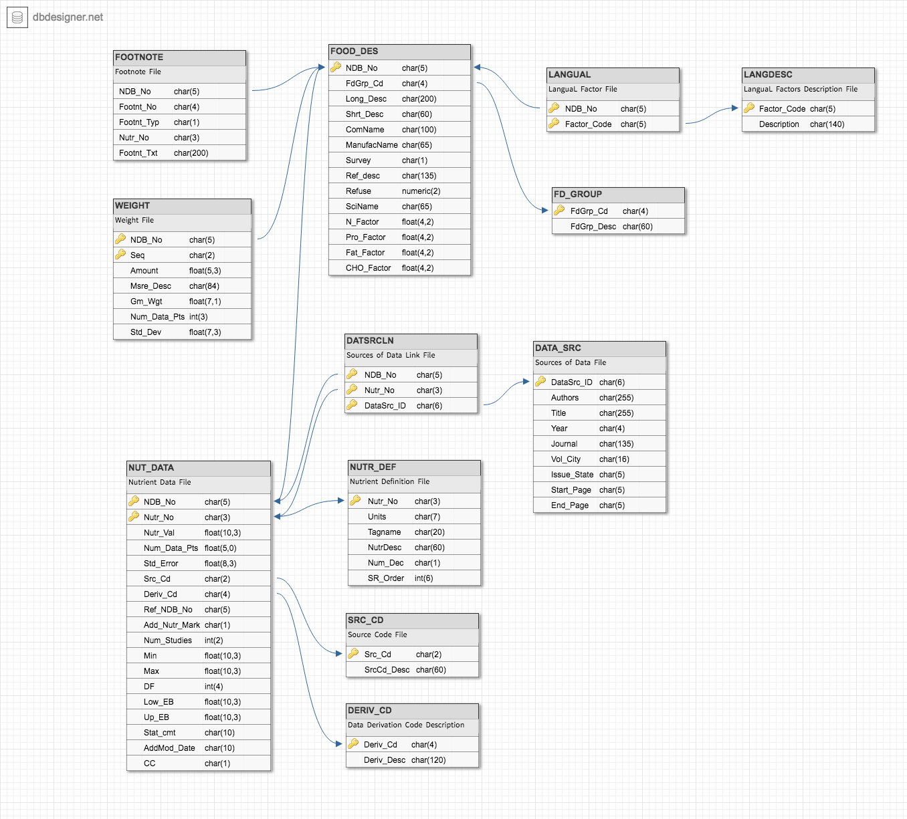

# Creating the Docker Image: USDA Food Nutrition Database
This Docker image uses data provided by the United States Department of Agriculture, Agricultural Research Service (USDA ARS). According to the USDA ARS, this data is the major source of food composition data in the United States and provides the foundation for most food composition databases in the public and private sectors. They indicate that this data-set contains information on 7,793 food items and up to 150 food components.

##### Requirements
Here are the items that were used to create this database:
* The documentation file: `SR-Legacy_Doc.pdf`. Provided in a zip file in this repo.
* All the ASCII data-files. Listed below and provided in a zip file in this repo.
* The database structure. Displayed below.
* The database relationsihps. Listed below.

###### ASCII data-files
Required data-files, obtained from the USDA website:

| | | | |
| :---: | :---: | :---: | :---: |
| DATA_SRC.txt | DATSRCLN.txt | DERIV_CD.txt | FD_GROUP.txt |
| FOOD_DES.txt | FOOTNOTE.txt | LANGDESC.txt | LANGUAL.txt |
| NUT_DATA.txt | NUTR_DEF.txt | SRC_CD.txt | WEIGHT.txt |

**Note**: these files, along with the documentation, can be found in `USDAFoodDB/Src/SR-Leg_ASC.zip`

###### Database Structure

###### Database Relationships
| | | | | |
| ---: | --- | ---: | --- | :---: |
| **ONE** | FOOD_DES| **TO MANY** | NUT_DATA | |
| **ONE** | FOOD_DES| **TO MANY** | WEIGHT | |
| **ONE** | FOOD_DES| **TO MANY** | FOOTNOTE | |
| **ONE** | FD_GROUP| **TO MANY** | FOOD_DES | |
| **MANY** | FOOD_DES| **TO MANY** | LANGDESC | intermediary: LANGUAL |
| **ONE** | SRC_CD | **TO MANY** | NUT_DATA | |
| **ONE** | DERIV_CD| **TO MANY** | NUT_DATA | |
| **ONE** | NUTR_DEF| **TO MANY** | NUT_DATA | |
| **MANY** | NUT_DATA| **TO MANY** | DATA_SRC | intermediary: DATASRCLN |

